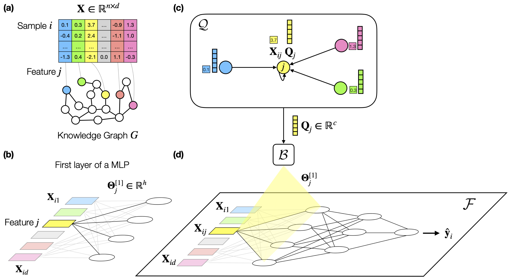

# PLATO: High dimensional, tabular deep learning with an auxiliary knowledge graph

<p align="center">

</p>

**PLATO is a method that enables deep learning on a tabular dataset with orders-of-magnitude more features than samples by using an auxiliary knowledge graph.** **(a)** In PLATO, every input feature in a tabular dataset corresponds to a node in an auxiliary knowledge graph with information about the domain. **(b)** In the first layer of a MLP, every input feature corresponds to a vector of weights. **(c,d)** PLATO is based on the inductive bias that, if two input features correspond to similar nodes in the auxiliary KG, they should have similar weight vectors in the first layer of the MLP. PLATO captures the inductive bias by inferring the weight vector for each input feature from its corresponding node in the auxiliary KG. Ultimately, input features with similar embeddings produce similar weight vectors, regularizing the MLP and capturing the inductive bias.

For more information about PLATO, please refer to our [paper](https://openreview.net/pdf?id=GGylthmehy), [5-minute video](https://neurips.cc/virtual/2022/poster/72216), [slides](https://neurips.cc/virtual/2022/poster/72216), or [poster](https://neurips.cc/virtual/2022/poster/72216)!

## Under Construction
We are preparing the final version of the code, data, and graph to release at this repo! If you'd like to be notified when the final version is released, you can watch or star the repo.

## Contact
Please contact Camilo Ruiz (caruiz@cs.stanford.edu) and Hongyu Ren (hyren@cs.stanford.edu) with any questions.

## Citation
```
@inproceedings{ruiz2023high,
  title={High dimensional, tabular deep learning with an auxiliary knowledge graph},
  author={Ruiz, Camilo and Ren, Hongyu and Huang, Kexin and Leskovec, Jure},
  booktitle={Thirty-seventh Conference on Neural Information Processing Systems},
  year={2023}
}
```
